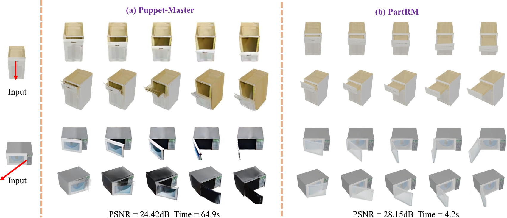

# PartRM: Modeling Part-Level Dynamics with Large 4D Reconstruction Model

This repository is an official implementation for:

**PartRM: Modeling Part-Level Dynamics with Large 4D Reconstruction Model**



## Introduction
As interest grows in world models that predict future states from current observations and actions, accurately modeling part-level dynamics has become increasingly relevant for various applications. Existing approaches, such as Puppet-Master, rely on fine-tuning large-scale pre-trained video diffusion models, which are impractical for real-world use due to the limitations of 2D video representation and slow processing times. To overcome these challenges, we present PartRM, a novel 4D reconstruction framework that simultaneously models appearance, geometry, and part-level motion from multi-view images of a static object. PartRM builds upon large 3D Gaussian reconstruction models, leveraging their extensive knowledge of appearance and geometry in static objects. To address data scarcity in 4D, we introduce the PartDrag-4D dataset, providing multi-view observations of part-level dynamics across over 20,000 states. We enhance the model’s understanding of interaction conditions with a multi-scale drag embedding module that captures dynamics at varying granularities. To prevent catastrophic forgetting during fine-tuning, we implement a two-stage training process that focuses sequentially on motion and appearance learning. Experimental results show that PartRM establishes a new state-of-the-art in part-level motion learning and can be applied in manipulation tasks in robotics. Our code, data, and models will be made publicly available to facilitate future research.

## Environment Setup
Use `conda` to create a new virtual enviroment
```bash
conda env create -f environment.yaml
conda activate partrm
```
Also with gaussian splatting renderer
```bash
# a modified gaussian splatting (+ depth, alpha rendering)
git clone --recursive https://github.com/ashawkey/diff-gaussian-rasterization
pip install ./diff-gaussian-rasterization
```

## PartDrag-4D Dataset
You need to first get PartNet-Mobility dataset and put it in the `PartDrag4D/data` dir of this repo.
Then
```bash
cd PartDrag4D
```
For mesh preprocess and mesh animating:
```bash
cd preprocess
python process_data_textured_uv.py
python animated_data.py
```
For rendering
First download blender:
```bash
cd ../rendering/blender
wget https://download.blender.org/release/Blender3.5/blender-3.5.0-linux-x64.tar.xz
```

Then
```bash
cd ..
bash render.sh
```
You can modify `num_gpus` and `CUDA_VISIBLE_DEVICES` to adjust the degree of parallelism.

For surface drags extraction:
```bash
cd ..
python z_buf_al.py
```

The animated meshes and extracted surface drags are stored in `PartDrag4D/data/data/processed_data_partdrag4d`. The rendering results are stored in `PartDrag4D/data/render_PartDrag4D`

## Images and Drags Preprocessing
To generate multi-view images for **evaluation data**:
```bash
cd ../preprocess
python gen_mv_partdrag4d.py --src_filelist /path/to/src/rendering/filelist --output_dir /path/to/save/dir # For PartDrag-4D
python gen_mv_objaverse_hq.py --src_filelist /path/to/src/rendering/filelist --output_dir /path/to/save/dir # For Objaverse-Animation-HQ,
```
The `src_filelist` is the path to the rendering filelist. You can refer to `filelist/eval_objaverse_hq.txt` and `filelist/val_filelist.txt` for example.

To generate propagated drags for **PartDrag-4D** dataset:
```bash
python gen_propagate_drags.py --val_filelist /path/to/src/rendering/filelist --sample_num [The number of propagated drags] --save_dir /path/to/save/drags
```
The `val_filelist` is the same as the `src_filelist` (multi-view images generation) for PartDrag-4D above.

We will release the SAM and Zero123++ checkpoints soon.

## Training
We provide training scripts for `PartDrag-4D` and `Objaverse-Animation-HQ` datasets. You can adjust the dataset for training in `line84` of the `train.py` (partdrag4d or objavser_hq). Then run:
```bash
CUDA_VISIBLE_DEVICES=0,1,2,3 accelerate launch --config_file acc_configs/gpu4.yaml train.py big --workspace [your workspace]
```

You should specify the `train_filelist`, `val_filelist`, `zero123_val_filelist`, `propagated_drags_base` and `mesh_base` in `core/options.py` and `core/options_pm.py`. 

- For `train_filelist`, you can refer to `filelist/train_filelist.txt` and `filelist/train_objavser_hq.txt`.

- For `val_filelist`, you can refer to `filelist/val_filelist.txt` and `filelist/eval_objaverse_hq.txt`. 

- For `zero123_val_filelist`, you can refer to `filelist/zero123_val_filelist.txt` and `filelist/zero123_val_filelist_objavser_hq.txt`.

For the 2-stage training proposed in paper, you should first set the `stage1` in `core/options.py` and `core/options_pm.py` true. After the motion-learning traing, set the `stage1` False to conduct the apperance learning training.

We will release gaussian database and pretrained checkpoints soon.

## Evaluation
For evaluation, you should first run
```bash
CUDA_VISIBLE_DEVICES=0 accelerate launch --config_file acc_configs/gpu1.yaml eval.py big --workspace [your workspace]
```
Then you should generte your eval filelist with every line like
```
gt_image_path,pred_image_path,source_image_path
```
The specify the `VAL_FILELIST` (The path of generated eval filelist) in `compute_metrics.py` and run:
```
python compute_metrics.py
```

# Acknowledgement
We build our work on LGM, Zero123++ and Gaussian Splatting.
